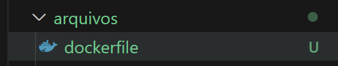
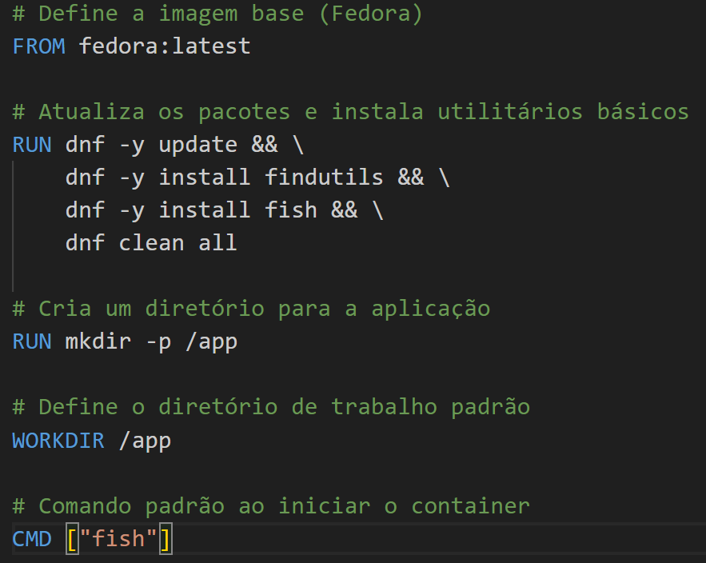
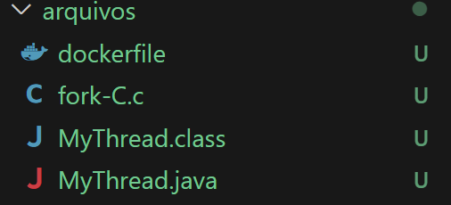
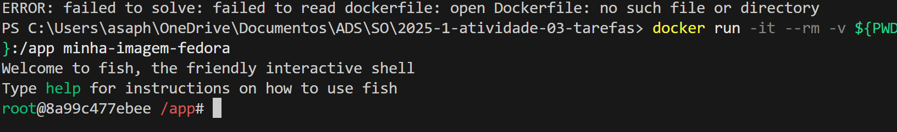
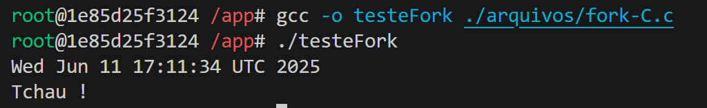
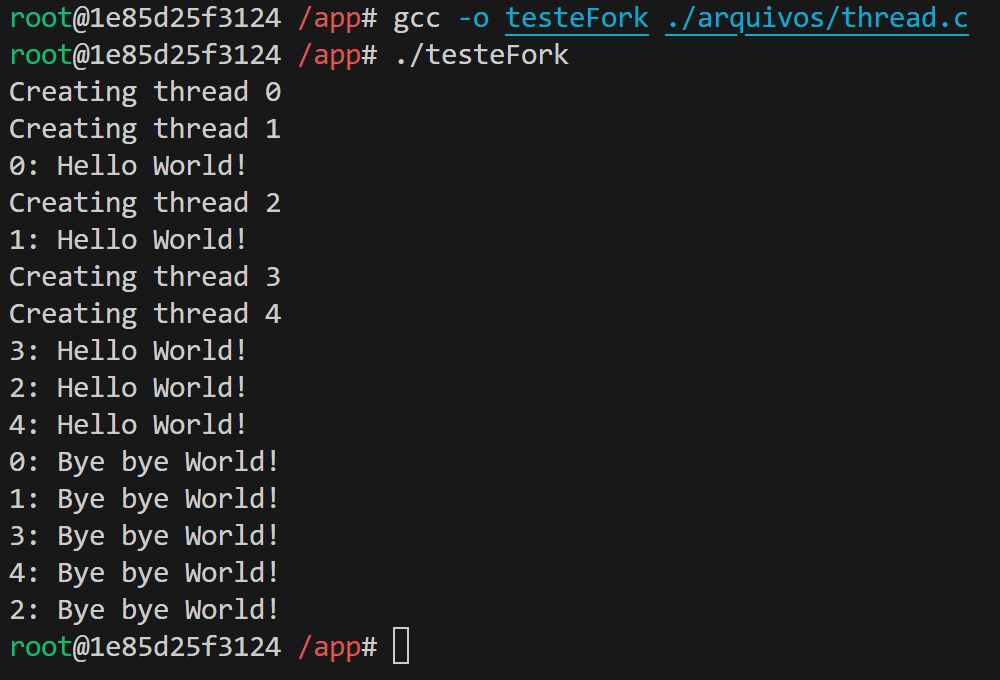
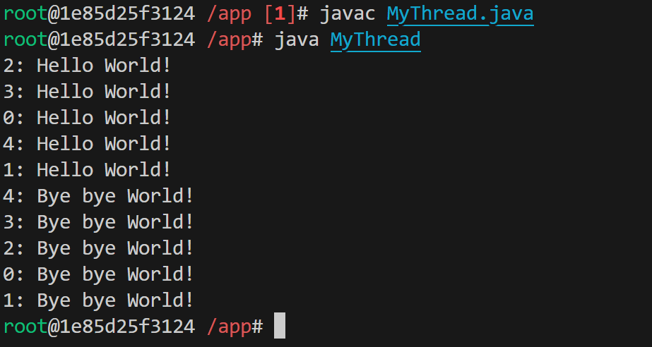

### 2.3. Relatório da Prática

**Observações:**
- O relatório deve estar no mesmo repositório do projeto.
- O formato deve ser Markdown.
- É necessário incluir capturas de tela ilustrando os processos.
- Apesar da atividade ser em grupo, o relatório deve ser elaborado individualmente.

**Nome:** Asaph Arruda  
**Data:** 20/05/2025

---

### **1. Objetivo**  
O principal objetivo desta atividade foi compreender o uso de `Dockerfile` para configurar ambientes de compilação de códigos nas linguagens C e Java. Através do `Dockerfile`, foi possível preparar um ambiente customizado com o shell `fish`, viabilizando a execução dos programas de forma isolada e reproduzível.

---

### **2. Procedimentos Realizados**

1. Estruturação do diretório de trabalho  
   

2. Inserção das instruções no `Dockerfile`  
   

3. Adição dos arquivos-fonte ao diretório  
   

4. Execução do container Docker  
   

---

### **3. Resultados Obtidos**

Durante os testes de execução, os códigos funcionaram conforme o esperado. No entanto, foi observado que, sempre que era necessário adicionar um novo arquivo ao projeto, era preciso reiniciar o container. Acredito que esse comportamento possa ser otimizado com ajustes no `Dockerfile` ou utilizando volumes do Docker para persistência e sincronização de arquivos com o sistema host.

- Execução do programa *fork.c*  
  

- Execução do programa *thread.c*  
  

- Execução do programa *thread.java*  
  

---

### **4. Conclusão**

A prática foi bastante enriquecedora, pois evidenciou o quanto o uso de `Dockerfile` pode facilitar o gerenciamento de ambientes de desenvolvimento. A capacidade de customização e padronização proporcionada pela ferramenta torna-a extremamente útil, especialmente em projetos colaborativos ou que exigem ambientes consistentes entre diferentes máquinas.
